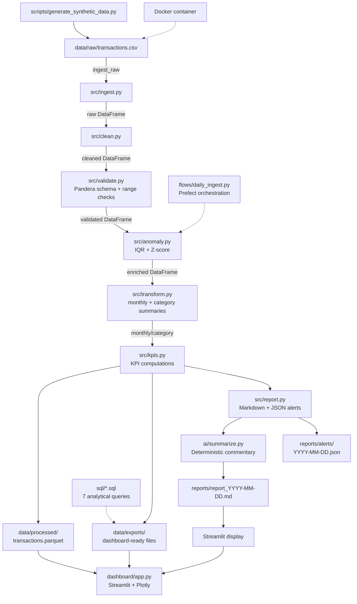

# Architecture



## Data Flow

1. **Ingest** — Load CSV from `data/raw/` with zero transformation
2. **Clean** — Deduplicate, standardize dates, enforce types, add derived columns
3. **Validate** — Pandera schema + range contracts (fail-fast)
4. **Anomaly** — IQR (default) + Z-score per category, combined flag
5. **Transform** — Monthly summary, category summary, MoM/YoY variance
6. **Export** — Parquet + CSV for BI tools
7. **Report** — Markdown report + JSON alerts if thresholds breached
8. **AI** — Deterministic commentary from structured KPI dict

## Layers

| Layer | Responsibility | Failure Mode |
|-------|---------------|--------------|
| `src/ingest.py` | Data loading | FileNotFoundError |
| `src/clean.py` | Data quality | Warnings logged |
| `src/validate.py` | Schema contracts | ValueError (fail-fast) |
| `src/anomaly.py` | Outlier detection | Logger warnings |
| `src/transform.py` | Aggregation | Returns empty DataFrame |
| `src/kpis.py` | Metrics | Returns zeros for empty |
| `src/report.py` | Output generation | File write errors |
| `ai/summarize.py` | Commentary | Fallback template |

## Configuration

All thresholds and paths are driven by `config.yaml`:

- `validation.amount_min/max`: Range contract for amounts
- `validation.allowed_currencies` / `validation.allowed_types`: Allowed value sets
- `anomaly.iqr_multiplier`: IQR sensitivity (default 1.5)
- `anomaly.zscore_threshold`: Z-score cutoff (default 3.0)
- `anomaly.alert_threshold_count`: Alert if anomalies > N (default 5)
- `anomaly.cashflow_deviation_pct`: Alert if MoM > X% (default 25%)
- `kpis.burn_rate_trailing_months`: Lookback window for burn rate
- `dashboard.top_n_categories`: Categories shown in dashboard

## SQL Layer

7 SQL queries (SQLite dialect) demonstrate window functions. They are run
manually against a SQLite database loaded from `data/exports/`:

- `01_monthly_cashflow.sql` — CTE + GROUP BY
- `02_expenses_by_category.sql` — `SUM() OVER`, `RANK()`
- `03_mom_yoy_variance.sql` — `LAG(1)`, `LAG(12)`
- `04_largest_transactions.sql` — `RANK()`, `DENSE_RANK()`
- `05_rolling_30d_avg.sql` — `AVG() OVER (ROWS BETWEEN 29 PRECEDING)`
- `06_cumulative_balance.sql` — `SUM() OVER (UNBOUNDED PRECEDING)`
- `07_anomalous_zscore.sql` — JOIN + filter for z-scores

## AI Layer

- Contract: `dict → str (≤120 words)`
- Always uses deterministic fallback
- Never sends raw PII or transaction data
- Extensible to LLM with `ai/summarize.py` hook

## Security Notes

- No real banking API connected
- All data synthetic
- `.gitignore` excludes `.env`, `credentials*`, `*.pem`
- No secrets in repository
- Suitable for portfolio demonstration only

## Docker Deployment

```bash
docker build -t financial-operations-analytics .
docker run -p 8501:8501 financial-operations-analytics
```

## Orchestration

Optional Prefect flow for daily automation:

```bash
pip install prefect
prefect deploy flows/daily_ingest.py:daily_flow
```
